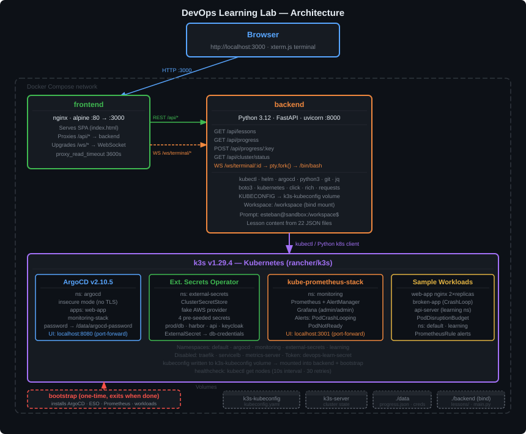

# DevOps Learning Lab

> A self-hosted, interactive lab for learning the full DevOps stack — with a **real Kubernetes cluster** running inside Docker on your laptop.

Every lesson includes written theory and hands-on exercises you complete in a live bash terminal connected to a real k3s cluster. No simulators, no sandboxed abstractions — you run actual `kubectl`, `helm`, `argocd`, and Python commands against real infrastructure.

---

## Architecture



---

## What you get

- **Structured lessons** across 14 topics, ordered from Linux basics to GitOps, Security, and Observability
- A **live k3s Kubernetes cluster** that boots inside Docker — pre-loaded with ArgoCD, Prometheus, Grafana, and External Secrets Operator
- An **in-browser terminal** (real bash shell) so you can follow along without leaving the UI
- **Split view** — read the lesson on the left, run commands on the right, side by side
- Progress tracking saved locally — pick up exactly where you left off

---

## Quick start

**Requirements:** Docker with Compose v2 · ~4 GB RAM free · macOS, Linux, or Windows (WSL2)

```bash
git clone https://github.com/estebanmorenoit/devops-learning-lab.git
cd devops-learning-lab
./start.sh build
```

Then open **http://localhost:3000**.

> **First run takes 3–5 minutes.** The cluster status indicator in the top-right corner turns green once k3s, ArgoCD, ESO, and Prometheus finish bootstrapping. Watch progress in a separate terminal with `./start.sh logs-bootstrap`.

---

## Using the lab

### Dashboard

The dashboard is your home base. It shows all 12 topic cards with your progress on each. Click any card — or any lesson in the left sidebar — to jump straight to it.

Lessons are ordered in the recommended sequence. Later topics build on earlier ones, so working through them in order gives the best experience.

### Lessons

Each lesson has two parts:

1. **Theory panel** — structured explanation, examples, and code snippets
2. **Terminal** — a live bash shell in the sandbox. Commands run against the real cluster

Use the **Split / Theory / Term** toggle in the top-right to switch between views. Split view lets you read and run commands at the same time.

When you finish a lesson, hit **Mark complete** in the top bar to record your progress.

### The terminal

The terminal is a real bash shell inside the sandbox container — not a simulation. Everything you run there affects the live k3s cluster.

Type `help-devops` at any time for a quick reference of common commands and shortcuts.

---

## Curriculum

| Topic | Lessons |
| ----- | ------- |
| **Linux & OS** | Linux Fundamentals · Terminal Mastery & System Monitoring |
| **Git** | Git Fundamentals |
| **Networking** | Networking & Protocols · TLS, Certificates & PKI · Web Servers, Reverse Proxies & Load Balancers |
| **Docker** | Images, Layers & Networking |
| **Kubernetes** | Core Concepts · Operations · Service Mesh · API Gateways & Ingress |
| **Cloud** | AWS Fundamentals · Multi-Cloud: Azure & GCP |
| **IaC** | Terraform Modules & State · Configuration Management with Ansible |
| **CI/CD & Helm** | GitLab CI/CD · CI/CD with GitHub Actions · Helm Chart Authoring |
| **GitOps** | GitOps & ArgoCD |
| **Security** | Secret Management · Kubernetes RBAC · Network Policies · Container Security |
| **Observability** | Prometheus & PromQL · Logs Management · Distributed Tracing · Log Aggregation · Alerting |
| **Bash** | Defensive Scripting · Text & Data Wrangling · Idempotent Scripts · Reusable Libraries · kubectl Scripting · Arrays · Advanced String Processing |
| **Python** | Basics for DevOps · subprocess · boto3 · Kubernetes Client · REST APIs · OOP · Testing |
| **Projects** | GitLab CI Helper · ESO Secret Rotation · Namespace & Cost Hygiene CLI · Keycloak & On-Prem Ops |

---

## Commands

```bash
./start.sh                   # Start the lab (builds images on first run)
./start.sh build             # Force rebuild images — use after Dockerfile changes
./start.sh stop              # Stop containers, keep cluster state (fast restart)
./start.sh reset             # Full wipe — removes cluster state and volumes
./start.sh logs              # Tail backend + frontend logs
./start.sh logs-bootstrap    # Tail cluster bootstrap logs
./start.sh logs-k3s          # Tail k3s control-plane logs
./start.sh restart           # Restart the backend container only
./start.sh shell             # Open an interactive bash shell in the backend
./start.sh argocd-ui         # Port-forward ArgoCD → http://localhost:8080
./start.sh grafana-ui        # Port-forward Grafana → http://localhost:3001
```

> ArgoCD admin password is written to `./data/argocd-password` by the bootstrap script.

---

## Sandbox environment

### Pre-installed tools

`kubectl` · `helm` · `argocd` · `k9s` · `python3` · `boto3` · `git` · `jq` · `curl` · `openssl` · `vim`

### Shell aliases

| Alias | Command |
|-------|---------|
| `k` | `kubectl` |
| `kgp` | `kubectl get pods` |
| `kgpa` | `kubectl get pods -A` |
| `kgn` | `kubectl get nodes` |
| `kgs` | `kubectl get svc` |
| `kgd` | `kubectl get deploy` |
| `kl` | `kubectl logs` |
| `kd` | `kubectl describe` |
| `kaf` | `kubectl apply -f` |
| `kdr` | `kubectl --dry-run=client -o yaml` |
| `agl` | `argocd app list` |
| `ags` | `argocd app sync` |
| `agg` | `argocd app get` |

### Workspace files

The `/workspace` directory is pre-populated with realistic sample files used across lessons. It persists between restarts — use it to save your own scripts and notes.

| File | Purpose |
|------|---------|
| `app.log` | Structured app log with errors, OOMKills, restarts |
| `pod.log` | Pod lifecycle log with CrashLoopBackOff sequence |
| `access.log` | nginx access log with 4xx/5xx entries |
| `deployment.yaml` | Sample Kubernetes Deployment manifest |
| `values.yaml` | Helm values file with intentionally unpinned image tags |
| `config.yaml` | App config referencing cluster-internal services |
| `check_images.py` | Starter Python script (finds unpinned `latest` tags) |

### Mock AWS environment

boto3 lessons use a pre-configured mock AWS environment so you can learn the SDK without a real AWS account:

```
AWS_DEFAULT_REGION=us-east-1
AWS_ACCOUNT_ID=123456789012
AWS_PROFILE=default
```

---

## What's pre-installed in the cluster

The bootstrap container sets everything up on first start — you don't need to do anything manually.

**ArgoCD** — two sample applications registered and syncing:
- `web-app` → ArgoCD guestbook example
- `monitoring-stack` → helm-guestbook example

**External Secrets Operator** — a `ClusterSecretStore` named `fake-aws-secrets` with four pre-seeded fake keys for learning:
```
prod/db/password
prod/harbor/robot-token
prod/api/key
prod/keycloak/admin
```

**Prometheus alerts** — two alerting rules in the `monitoring` namespace:
- `PodCrashLooping` — fires when a pod restarts more than 3 times in 15 minutes
- `PodNotReady` — fires when a pod stays unready for 5+ minutes

**Sample workloads:**
- `default/web-app` — 2-replica nginx deployment with a PodDisruptionBudget (healthy baseline)
- `default/broken-app` — intentionally crash-looping busybox (for debugging practice)
- `learning/api-server` — http-echo server used by Python and ESO lessons

---

## Exposed ports

| Port | Service | Notes |
|------|---------|-------|
| 3000 | Frontend | Main UI |
| 8000 | Backend (FastAPI) | API + WebSocket terminal |
| 8080 | ArgoCD UI | After `./start.sh argocd-ui` |
| 3001 | Grafana | After `./start.sh grafana-ui` (admin / prom-operator) |
| 9090 | Prometheus | Manual: `kubectl port-forward svc/monitoring-kube-prometheus-prometheus -n monitoring 9090:9090` |

---

## Persistence

| What | Where | Survives `stop`? | Survives `reset`? |
|------|-------|-----------------|------------------|
| Lesson progress | `./data/progress.json` | Yes | No |
| ArgoCD password | `./data/argocd-password` | Yes | No |
| Cluster state | `k3s-server` Docker volume | Yes | No |
| Workspace files | Inside container | No | No |

---

## Resetting to a clean state

```bash
./start.sh reset   # removes Docker volumes and bootstrap flag
./start.sh build   # rebuilds images and re-bootstraps (~5 min)
```

---

## Contributing

Contributions are welcome — new lessons, bug fixes, documentation improvements, and tooling enhancements. See [CONTRIBUTING.md](CONTRIBUTING.md) for dev setup, the lesson JSON schema, and the PR checklist.

To run the test suite:

```bash
./start.sh shell
python -m pytest tests/ -v
```

---

## Stack

| Layer | Technology | Version |
|-------|-----------|---------|
| Cluster | k3s | v1.36.1 |
| GitOps | ArgoCD | v2.10.5 |
| Secrets | External Secrets Operator | latest chart |
| Monitoring | kube-prometheus-stack | latest chart |
| Backend | Python + FastAPI + uvicorn | 3.14 / 0.136.3 / 0.48.0 |
| Frontend | nginx alpine | — |
| Terminal | xterm.js | 5.3.0 |

### Project layout

```
devops-learning-lab/
├── start.sh                      # CLI wrapper for all docker compose operations
├── docker-compose.yml            # Four services: k3s, bootstrap, backend, frontend
├── LICENSE
├── CONTRIBUTING.md
├── data/                         # Persisted data: progress, ArgoCD credentials
├── backend/
│   ├── main.py                   # FastAPI app + PTY WebSocket handler
│   ├── requirements.txt
│   ├── Dockerfile                # Python 3.14, kubectl, helm, argocd, Python DevOps libs
│   ├── Dockerfile.bootstrap      # One-shot cluster setup (alpine/k8s)
│   ├── lessons/
│   │   ├── registry.py           # Ordered lesson list and curriculum registry
│   │   └── content/              # One JSON file per lesson, organised by topic
│   ├── tests/
│   │   ├── test_lessons.py       # Lesson schema and registry validation (296 tests)
│   │   └── test_api.py           # API endpoint tests
│   └── scripts/
│       ├── bootstrap-cluster.sh  # Installs ArgoCD, ESO, Prometheus; deploys sample workloads
│       ├── init-workspace.sh     # Populates /workspace with sample files
│       └── help-devops.sh        # In-terminal quick reference
└── frontend/
    ├── index.html                # Single-page app: lesson viewer + xterm.js terminal
    ├── Dockerfile                # nginx alpine
    └── nginx.conf                # SPA routing + /api/ and /ws/ proxy to backend
```

---

## License

MIT — see [LICENSE](LICENSE).
